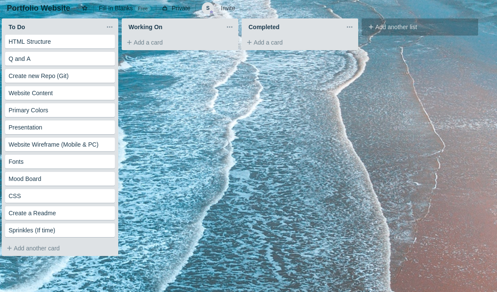
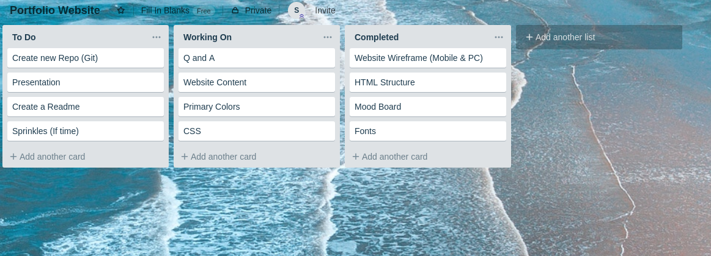
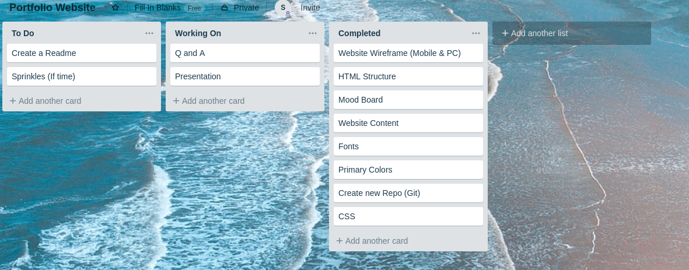

## Website Portfolio
---
#### Links

* [Portfolio Website](https://sjwconway.github.io/ "Portfolio Website")
* [Github Repo](https://github.com/sjwconway/Portfolio "Github")

### Description
#### Purpose
The site aims to spark interest in possible future employers, by displaying skills in said site, displaying an idea about my character and past work and life experience.
#### Functionality / Features
* Fixed Navbar
* Transistions
* Smooth Scroll Behaviour
* Transform Scale
* Greyscale effects on some imgs
* Hover effects

#### Screenshots

#### Target Audience
Any potential future employers, other developers who may be looking for inspiration to create their own portfolio website.

#### Tech Stack
* HTML
* CSS
* GitHub
* Trello
* Pin Interest

### Design Docs & Planning

#### Wireframe

#### Trello

## Q&A
####  Key events in the development of the internet from the 1980s to today.
in 1982, TCP (Transmission Control Protocol) and IP (Internet Protocol) became the protocol for ARPNET (Advanced Research Projects Agency Network). Do this day TCP/IP is still the standard protocol for the internet as we know it today. The following year, Domain Name System (DNS) was established to tackle the issue of making websites designation easier to remember. DNS brought in many familiar domains such as .com, .gov, .net etc. Before DNS, website designations would look something like this 123.456.789.10. in 1990  Tim Bernes-Lee developed HTML. To this day it is still hugely used in how we structure and navigate sites today.

in 1991 World wide web is introduces to the public. 1998 saw the IPv6 introduced. IPv6 provides a 128 bit address which allows  for 340 trillion trillion trillion unique adresses. IPv4 the previous protocol version, only allowed for 4.3 billion unique adresses, which just recently has been filled. IPv6 will allow massive growth for unique adresses for the long forseeable future. 2004 Facebook goes live and starts the era of social networking. 2010 Facebook reaches 400 million users. 2016 saw the arrival of "Smart Computerized Assitant". Examples of these are Alexa (Amazon), Siri (Apple) and Cortana (Mircosoft).  

####  Relationship between fundamental aspects of the internet such as: domains, web servers, DNS, and web browsers
Domains are the combination of numbers that make up that said websites address. However this isn't very nice an readable way to remember addresses. DNS was a solution for this, you can think of an DNS to be an Address book for websites. say you type in a Web Address into your browser, the browser will then look for that Websites DNS  to find the websites real address before it can retrieve that website. Web Severs are used to store all that information that you are requesting, when you send the request for a website, it will find the server  that stores that address, and make a copy of that website which is then displayd on the client device.

So in Summary the relationships between can be describe in the following way:
Client has typed a DNS(rememberal name) into a web browser.
web browser sends an HTTP request to the web server is storing that address, asking it to send a copy of the website back to the Client. That message and all other data sent between Client and Server, is sent across the Clients internet connection using TCP/IP.

#### Reflect on one aspect of the development of internet technologies and how it has contributed to the world today
One of the main aspects of the internet that has contributed to the world today, would have to be the dramatic improvement of Communication.

from Social Platforms, to Emails, to Video conferences, all these things have helped us tackle the obstacle of distances and time for effective communication. This has been extremely helpful and beneficial to personal, business and education relationships. It has allowed people to tap into other peoples cultures and interact and learn about different parts of the world from the comfort of their own home. However not everyhing is rainbows and sunshines when it comes to this great improvment of communication. Social skills are taking a big hit, due to many people not communicating face to face anymore, but over a digital social platform. I think it is important to find a balance in communication between Human interaction and digital interaction.   

